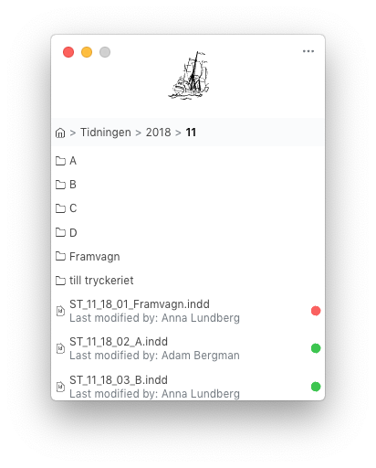

  <h1>Bryggan Desktop</h1>
  
The gap between InDesign and Dropbox

  

This is a productivity app mainly created for usage inside our company – but it
should probably work outside our company as well.

## Goal

We produce a magazine once a month and every month we do parallel work in
InDesign-files stored in our Dropbox-team folders.

Normally, when opening InDesign-files on your normal harddrive, or through other
types of servers, InDesign will check .idlk-files associated with the
InDesign-files.

If an associated .idlk-file is found, _and_ if it's not created by the current
user, InDesign will refuse to open it. But if you do the same thing inside a
Dropbox-folder every file will seem to, according to your OS, be created by the
current user. And InDesign will happily open the InDesign-file.

And if that happens and two people perform changes at the same time on the same
file the app will crash and changes might get lost in the void.

The goal of this tiny utility app is to bridge the gap between InDesign and
Dropbox and try to prevent simultaneous edits.

## Solution

This app, **Bryggan**, can be used as a simple file explorer to traverse your
team-folder contents from the desktop.

And when it encounters an .indd-file it will make an extra check to see if a
corresponding .idlk-file exists. If it exists it will refuse to open the
.indd-document.

The app checks everything against the Dropbox API:s which probably makes the
check a bit more secure. As compared to only check against the local filesystem
and the files synced by Dropbox to your local computer.

## Distribution

As of now this app can't be downloaded, it's only distributed internally at our
company due to the fact that I haven't yet found a way to properly hide and
secure important secrets – specifically the Dropbox Oauth Secret used to
authenticate users against Dropbox.

If anyone knows of a way to properly hide secrets in an Electron-based
application – please shout out!

## Releasing

As mentioned [above](#distribution) this software is not distributed in any way
right now. Instead just sent out internally. So this part is mainly for us to
keep track of how we release it internally.

1. Every new feature/fix/etc. is developed in it's own branch – several smaller
   branches might also be batched into one larger branch which later gets merged
   into master. Commits follow the
   [conventional-changelog](https://github.com/commitizen/cz-conventional-changelog)
   standard
2. Every branch then makes a PR against master and the CI checks must pass (as
   of now CI only runs tests and builds the front-end part of the application)
3. When a PR is accepted it should be rebased and merged (maybe even combine a
   few commits)
4. When merged Travis CI runs again on master – this time it also runs
   [semantic-release](https://github.com/semantic-release/semantic-release).
   semantic-release will check all commits and determine what the next version
   should be using cz-conventional-changelog
5. Once semantic-release is successfull a new [release](/releases) is created
   then it's time to go manual
   1. On local machine take the version determined by semantic-release and
      update the version number in `package.json`
   2. Run `yarn run dist`
   3. Upload `dist/Bryggan-${version}.dmg` to our Dropbox servers and notify
      collegues

## License

MIT Copyright (c) 2018 sjofartstidningen
